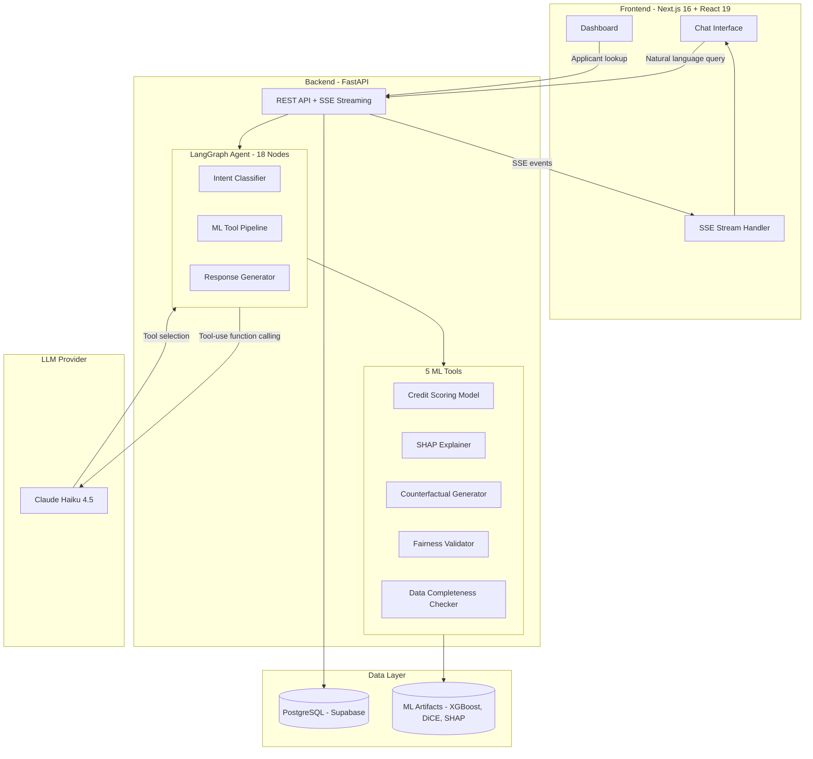
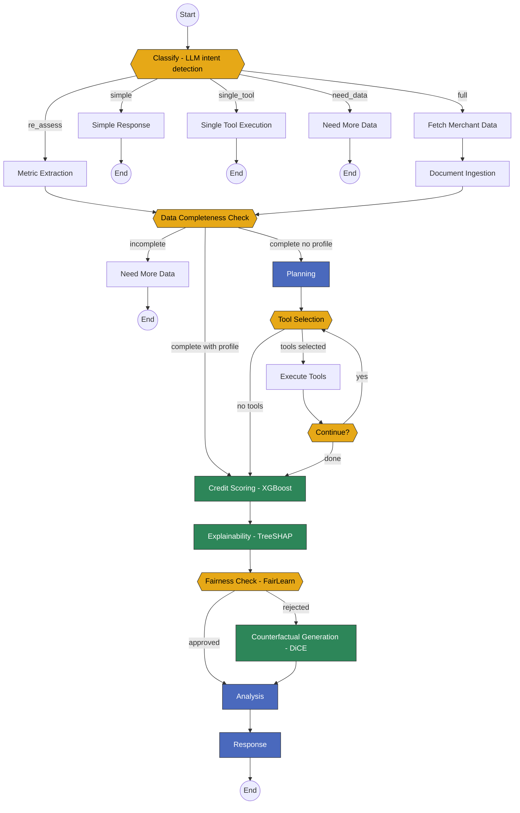
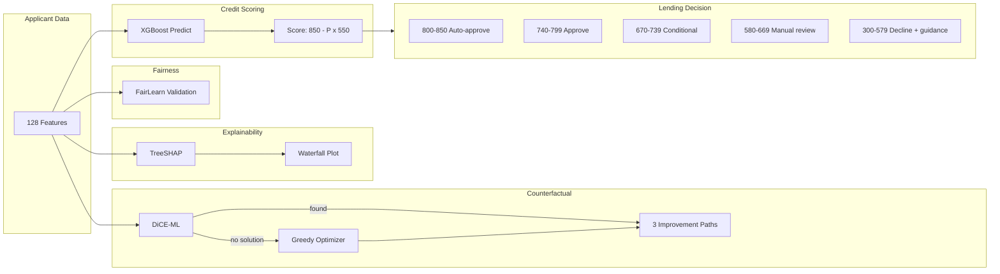

# Credence: Agentic Credit Assessment for Micro-SMEs

An autonomous AI agent that talks to loan officers in plain language, picks the right ML tools for each query, and explains every decision it makes. Built to approve more creditworthy micro-SMEs at comparable risk.

## The Problem

95% of Vietnamese businesses are micro-SMEs. 70-80% lack formal credit access — not because they're risky, but because traditional scoring models can't see them. IFC estimates 30-40% of MSME rejections come from data gaps, not actual risk.

## What Credence Does

A loan officer asks a question in natural language. The LangGraph agent classifies intent, selects and chains ML tools, and returns a scored, explained, and fairness-checked credit assessment.

**From our test set of 46,127 real applicant profiles:**

| Metric | Traditional Scoring | Credence |
|---|---|---|
| Approved applicants | 8,595 (18.6%) | 19,592 (42.5%) |
| Default rate among approved | 2.22% | 2.13% |
| Additional approvals | — | +10,997 (+128%) |

Credence approves **2.3x more applicants** at a **lower default rate**.

1,906 applicants that traditional scoring rejects are actually creditworthy. Credence finds them — at a 2.94% default rate, well within the 1.2x parity target.

## 5 Agent Tools

| Tool | Function | Technology |
|---|---|---|
| **Credit Scoring Model** | Default probability prediction, score 300-850 | XGBoost, 128 features, 307K training samples |
| **SHAP Explainer** | Per-decision feature importance with waterfall plots | TreeSHAP |
| **Counterfactual Generator** | Actionable improvement paths for declined applicants | DiCE-ML + greedy optimizer, effort-ranked |
| **Fairness Validator** | Demographic bias detection on every decision | FairLearn (disparate impact, equalized odds) |
| **Data Completeness Checker** | Missing fields ranked by scoring impact | SHAP-weighted field importance |

## System Architecture



## 18-Node LangGraph Agent

The agent uses a state-driven graph with conditional routing. Simple questions take 2 nodes, full assessments take 10+.



**Node types:**
- **Yellow** (decision): classify, data_completeness, tool_selection, fairness_check — conditional routing
- **Green** (ML pipeline): credit_scoring, explainability, counterfactual_generation — call ML tools directly, no LLM
- **Blue** (LLM reasoning): planning, analysis, response — call Claude with system prompts

## Pages

| Route | Purpose |
|---|---|
| `/` | Landing page |
| `/login` | Google OAuth sign-in |
| `/new` | New chat conversation |
| `/chat/[id]` | Chat with LangGraph agent (real-time SSE streaming) |
| `/dashboard` | Loan assessment dashboard with score cards, SHAP factors, improvement suggestions |

## Real-Time Agent Visibility

The chat interface streams every step the agent takes via Server-Sent Events:

```
node_start  --> "Computing credit score..."
tool_call   --> credit_score_model({features: ...})
tool_result --> {score: 718, band: "Good", probability: 0.24}
reasoning   --> "The applicant shows strong external scores..."
text        --> Final credit assessment report (streamed)
```

Each step renders as a collapsible card showing parameters and results. Full transparency into the agent's reasoning.

## Explainability Pipeline



## Dashboard

Split-pane loan assessment review:

- **CreditScoreCard** — Circular gauge (300-850), color-coded by score band
- **ApprovalProbabilityCard** — Status badge and loan recommendation
- **CreditFactorsList** — SHAP positive/negative factors with severity
- **ImprovementSuggestions** — Counterfactual paths with difficulty and projected score lift

## Tech Stack

| Layer | Technology |
|---|---|
| Frontend | Next.js 16, React 19, TypeScript, Tailwind CSS, shadcn/ui |
| Backend | FastAPI, async Python, SQLAlchemy |
| Agent | LangGraph (18-node state graph), LangChain |
| LLM | Claude Haiku 4.5 (Anthropic API) |
| ML | XGBoost, SHAP, DiCE-ML, FairLearn, scikit-learn |
| Database | PostgreSQL (Supabase) + pgvector |
| Auth | Google OAuth 2.0 + NextAuth.js |
| Streaming | Server-Sent Events (structured event types) |

## Project Structure

```
credence-chat/              # Next.js frontend (this repo)
├── app/(chat)/              # Chat interface with SSE streaming
├── app/dashboard/           # Loan assessment dashboard
├── components/              # Chat, dashboard, landing components
├── hooks/                   # use-structured-chat, use-message-adapter
├── lib/                     # SSE handler, API client, DB queries
│
credence-backend/            # FastAPI backend (submodule)
├── app/ai/                  # LangGraph agent, 18 nodes, routing edges
├── app/tools/               # 5 ML tools + document processing
├── app/routers/             # API endpoints (chat, applicants, auth)
├── ml_models/               # Trained XGBoost, DiCE, SHAP artifacts
│
jupyter-notebook/            # ML pipeline development
└── notebooks/               # SHAP, DiCE, FairLearn, full pipeline
```

## Quick Start

```bash
# From project root
./start-dev.sh

# Or manually:
# Terminal 1 — Backend
cd credence-backend
python -m venv venv && source venv/bin/activate
pip install -r requirements.txt
uvicorn app.main:app --reload --port 8000

# Terminal 2 — Frontend
cd credence-chat
pnpm install
pnpm dev
```

Backend: http://localhost:8000
Frontend: http://localhost:3000

## Model Performance

| Metric | Value |
|---|---|
| AUC-ROC | 0.7705 |
| KS Statistic | 0.4032 |
| Gini Coefficient | 0.5411 |
| Test profiles | 46,127 applicants |
| Training data | 307K samples, 128 features (Home Credit) |

### Score Band Separation

| Band | Default Rate | Decision |
|---|---|---|
| Exceptional (800-850) | 0.68% | Auto-approve |
| Very Good (740-799) | 1.53% | Approve |
| Good (670-739) | 2.70% | Approve with conditions |
| Fair (580-669) | 6.05% | Manual review |
| Poor (300-579) | 16.88% | Decline + counterfactual guidance |

25x default rate gradient from Exceptional to Poor — the model meaningfully separates risk.

## Demo

```
Loan Officer: "Assess applicant #270000"

Agent:
  [classify] --> full_assessment
  [data_completeness] --> 87% complete, proceeding
  [credit_scoring] --> Score: 718, Band: Good
  [shap_explainer] --> Top factors: external scores, employment
  [fairness_check] --> No bias detected
  [response] --> Structured credit report

Result: APPROVE with conditions
```

For declined applicants:

```
Score: 640 (Fair)
To reach approval (670+):
  1. Reduce loan from $35K to $20K  --> Score: 695 (Easy)
  2. Pay down $7K outstanding debt  --> Score: 688 (Moderate)
  3. Build 2 more years employment  --> Score: 710 (Long-term)
```

## References

- Lundberg & Lee, "A Unified Approach to Interpreting Model Predictions" (NeurIPS 2017)
- Wachter et al., "Counterfactual Explanations Without Opening the Black Box" (2021)
- Kusner et al., "Counterfactual Fairness" (NeurIPS 2017)
- Yao et al., "ReAct: Synergizing Reasoning and Acting in Language Models" (ICLR 2023)
- Home Credit Group, "Home Credit Default Risk" (Kaggle 2018)
